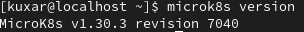

# kuber-01-kubectl
Домашнее задание к занятию «Kubernetes. Причины появления. Команда kubectl»

------

### Задание 1. Установка MicroK8S

Версия MicroK8S

дашборд

добавил "внешний ip"

после прописал  microk8s refresh-certs --cert front-proxy-client.crt

------

### Задание 2. Установка и настройка локального kubectl

Установлен клиент

подключен к ноду

+дашборд

------